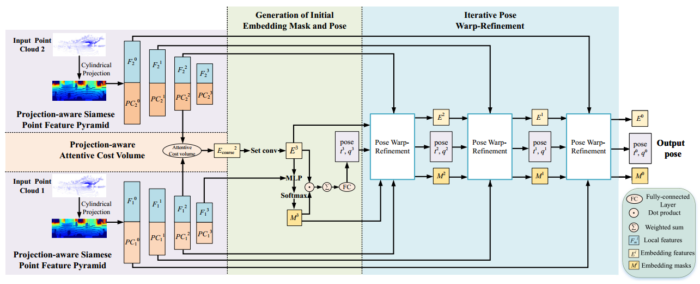
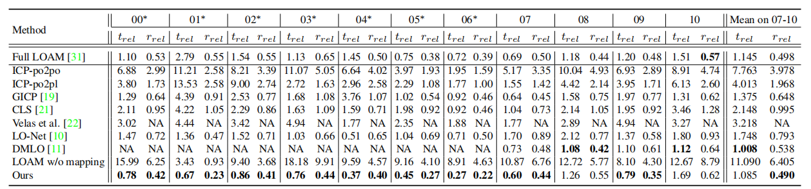

**EfficientLO-Net: Efficient 3D Deep LiDAR Odometry**
==============================================================================================================================
This is the official implementation of "EfficientLO-Net: Efficient 3D Deep LiDAR Odometry" created by Guangming Wang, Xinrui Wu, Shuyang Jiang, Zhe Liu and Hesheng Wang.


## Citation
If you find our work useful in your research, please cite:

        @article{wang2021efficient,
        title={Efficient 3D Deep LiDAR Odometry},
        author={Wang, Guangming and Wu, Xinrui and Jiang, Shuyang and Liu, Zhe and Wang, Hesheng},
        journal={arXiv preprint arXiv:2111.02135},
        year={2021}
        }


## Abstract

An efficient 3D point cloud learning architecture, named EfficientLO-Net, for LiDAR odometry is first proposed in this paper. In this architecture, the projection-aware representation of the 3D point cloud is proposed to organize the raw 3D point cloud into an ordered data form to achieve efficiency. The Pyramid, Warping, and Cost volume (PWC) structure for the LiDAR odometry task is built
to estimate and refine the pose in a coarse-to-fine approach hierarchically and efficiently. A projection-aware attentive cost volume is built to directly associate two discrete point clouds and obtain embedding motion patterns. Then, a trainable embedding mask is proposed to weigh the local motion patterns to regress the overall pose and filter outlier points. The trainable pose warp-refinement module is iteratively used with embedding mask optimized hierarchically to make the pose estimation more robust for outliers. The entire architecture is holistically optimized end-to-end to achieve adaptive learning of cost volume and mask, and all operations involving point cloud sampling and grouping are accelerated by projection-aware 3D feature learning methods. The superior performance and effectiveness of our LiDAR odometry architecture are demonstrated on KITTI odometry dataset. Our method outperforms all recent learning-based methods and even the geometry-based approach, LOAM with mapping optimization, on most sequences of KITTI odometry dataset. 


## Prequisites
    python 3.6.8
    CUDA 9.0
    TensorFlow 1.12.0  
    numpy 1.16.1  


## Usage

#### Compile Customized TF Operators
The TF operators are included under `tf_ops`, you need to compile them first by `make` under each ops subfolder (check `fused_conv.sh`). Update `fused_conv.sh` for different <a href="https://en.wikipedia.org/wiki/CUDA#GPUs_supported">CUDA Compute Capability</a> that suits your GPU if necessary.

    cd ./tf_ops/2d_conv_random_k
    sh fused_conv.sh
    cd ../2d_conv_select_k
    sh fused_conv.sh
    cd ..

    

#### Datasets

We use [KITTI odometry dataset](http://www.cvlibs.net/datasets/kitti/eval_odometry.php) in our experiments. The ground truth of pose and relative transformation are stored in `ground_truth_pose` and `ground_truth_pose/kitti_T_diff`. 
The data of the KITTI odometry dataset should be organized as follows:

```
data_root
├── 00
│   ├── velodyne
│   ├── calib.txt
├── 01
├── ...
```

### Training
Train the network by running 
    
    sh command.sh  

Please reminder to specify the `mode`(train), `GPU`,`model`(path to PWCLONet model), `data_root`, `log_dir`, `train_list`(sequences for training), `val_list`(sequences for validation) in the scripts.


The training results and best model will be saved in `log_dir`.

### Testing

Please run 

    sh command.sh 
    

Train the network by running `sh command.sh` please reminder to specify the `mode`(test), `GPU`,`model`(path to PWCLONet model), `data_root`,`checkpoint_path`(path to pre-trained model for testing), `log_dir`, `test_list`(sequences for testing).


### Quantitative results:




### Acknowledgments

We thank all the CVPR reviewers and the following open-source project for the help of the implementations:
- [PointNet++](https://github.com/charlesq34/pointnet2) (TF operators)
- [KITTI_odometry_evaluation_tool](https://github.com/LeoQLi/KITTI_odometry_evaluation_tool) 
- [PWCLO-Net](https://github.com/IRMVLab/PWCLONet) (Network design)
